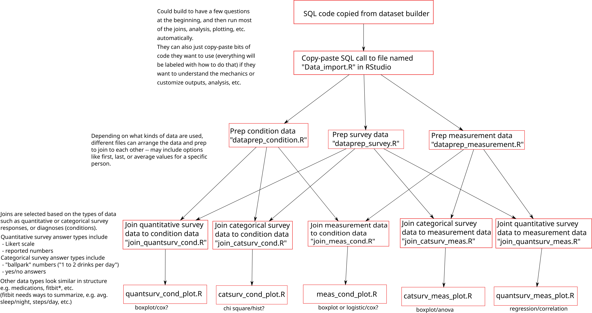
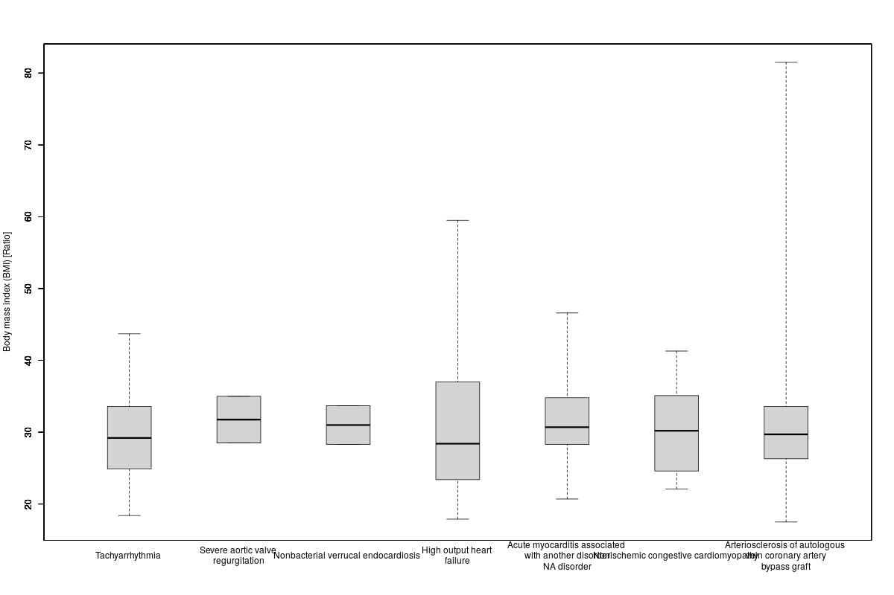

# AOU_R
R recipes for the AOU summer institute 2024

Goals: 
 - Have resources available for new users to perform simple analyses on AoU workbench data
 - Cover a range of user backgrounds and experience levels
 - Provide information that can be quickly understood and applied 
 - Provide guidance that can be used in later teaching situations

Overall approach: 
The cookbook will consist of code, descriptions, implementation directions, etc. for a few basic data analysis pipelines. Absolutely new users will be able to run certain analyses without any coding necessary, while those with some experience (or a desire to learn) will be able to adapt the provided code to fit their goals. 

All users should implement the following to import their data from the dataset builder to the RStudio workspace: [update with screenshots]
1. Generate the desired dataset from the dataset builder on the AoU website
2. Because RStudio is still in “beta”, they currently have to manually copy and paste the SQL code generated by the dataset builder to an R document. This document should be named “Data_import.R” for the rest of the process to work.
3. Copy-paste or download-upload the other R files (represented by the red boxes in the figure above) to RStudio.
4. Enter the text source(‘master.R’) in the RStudio console. This will pull in the data from the AoU database (which can take some time) and initiate a dialogue with a few basic questions, such as “Which of these comparisons are you interested in? [followed by a numbered list of all possible data comparisons from the provided data].” Based on the user input, specific steps will be automatically carried out to give them the desired output. (I am still working on implementing this step, the details depend on what we think should be included as options for data types and analysis).
5. Look at the outputs (plots, statistical results, etc.) in the RStudio “files” tab and select files to download.

Next steps for coding (or “coding curious”) users:
4. Determine what analyses need to be run for their specific research interests (i.e. identify endpoints on the table above for the kinds of plots and statistical analyses that would be useful)
5. Work backwards on the flowchart to see which files need to be run to perform those analyses.
6. Run the file from the console by entering source(‘filename.R’) for each necessary file, starting from the top (the first one should be Data_import.R) OR open each file and run each line individually by placing the cursor on the first line and pressing ctrl+enter (or cmd+return) for each line of the file.
7. After all the files have run, outputs are generated and can be viewed under the “files” tab in RStudio. If changes to plots are necessary, the user can open the plotting files (bottom row of the flowchart) and follow instructions to modify the code. If joins of multiple data types need to be modified, the R file(s) used in the next row up on the flowchart should be modified (instructions will be included in the file). 
After modifying the files, it is a good idea to restart R (click on session > Restart R) and run each file individually from the beginning to make sure the results are correct.
Download the necessary output files.

Example: Lung conditions and BMI
As an example, I have worked out the use of measurement data (BMI) and condition data (A few different lung conditions). 
[more of a walk-through]
This analysis generates a box plot and ANOVA analysis:

|           | Df     | Sum Sq           | Mean Sq          | F value          | Pr(>F) | 
|-----------|--------|------------------|------------------|------------------|--------| 
| Condition | 681    | 739549.87851589  | 1085.97632674874 | 17.8777921095185 | 0      |
| Residuals | 443282 | 26926913.2969462 | 60.7444319799725 |                  |        |

