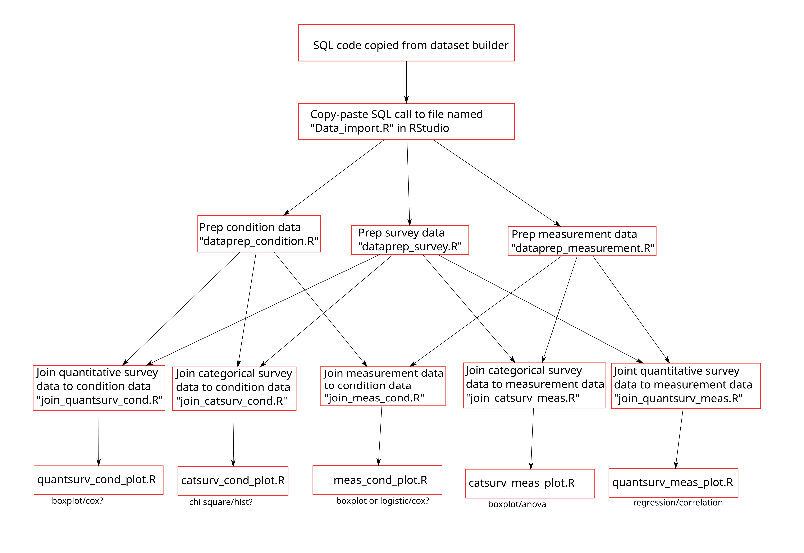

# AOU_R
**R recipes for the AOU summer institute 2024**

## Goals: 
 - Have resources available for new users to perform simple analyses on AoU workbench data
 - Cover a range of user backgrounds and experience levels
 - Provide information that can be quickly understood and applied 
 - Provide guidance that can be used in later teaching situations
 
## Overall approach: 
The cookbook will consist of code, descriptions, implementation directions, etc. for a few basic data analysis pipelines. Absolutely new users will be able to run certain analyses without any coding necessary, while those with some experience (or a desire to learn) will be able to adapt the provided code to fit their goals. 
 
## Basic R you might want to know
The basics of [R](https://github.com/ESodja/AOU_R/blob/main/R_basics.md) and [RStudio](https://github.com/ESodja/AOU_R/blob/main/RStudio.md)

## How to run your analyses
### Non-coding users: 
[update with screenshots]
1. Generate the desired dataset from the dataset builder on the AoU website
2. Copy and paste the SQL code generated by the dataset builder to an R document named “Data_import.R”.
3. Copy-paste or download-upload the other R files (represented by the red boxes in the figure above) to RStudio.
4. Enter the text `source(‘master.R’)` in the RStudio console. After some time, the console will ask some questions about your data, and then proceed with your analysis based on your answers.
5. Look at the outputs (plots, statistical results, etc.) in the RStudio “files” tab and select files to download.

[Example of non-coding workflow](https://github.com/ESodja/AOU_R/blob/main/BMI_Example.md)

### Coding (or “coding curious”) users:
1. Generate the desired dataset from the dataset builder on the AoU website
2. Copy and paste the SQL code generated by the dataset builder to an R document named “Data_import.R”.
3. Copy-paste or download-upload the other R files (represented by the red boxes in the figure above) to RStudio.
4. Determine what analyses need to be run for their specific research interests (i.e. identify endpoints on the table above for the kinds of plots and statistical analyses that would be useful)
5. Work backwards on the flowchart to see which files need to be run to perform those analyses.
6. Run the file from the console by entering `source(‘filename.R’)` for each necessary file, starting from the top (the first one should be Data_import.R) OR open each file and run each line individually by placing the cursor on the first line and pressing ctrl+enter (or cmd+return) repeatedly, once for each line of the file.
7. After all the files have run, view the generated outputs under the “files” tab in RStudio. 

If changes to plots are necessary, the user can open the plotting files (bottom row of the flowchart) and follow instructions to modify the code. 

If joins of multiple data types need to be modified, the R file(s) used in the next row up on the flowchart should be modified (instructions will be included in the file). 

Data selection for this project is handled entirely by the dataset builder. Help can be found [here](https://support.researchallofus.org/hc/en-us/articles/4556645124244-Using-the-Concept-Set-Selector-and-Dataset-Builder-tools-to-build-your-dataset).

After modifying the files, it is a good idea to restart R (click on session > Restart R) and run each file individually from the beginning to make sure the results are correct.

Download the necessary output files.

[Example of coding workflow](https://github.com/ESodja/AOU_R/blob/main/BMI_Example_code.md)

## Other resources
[using RStudio on the Researcher Workbench](https://support.researchallofus.org/hc/en-us/articles/22078658566804-Using-RStudio-on-the-Researcher-Workbench)

## Contact
[Email me!](mailto:eric.sodja@utah.edu)

