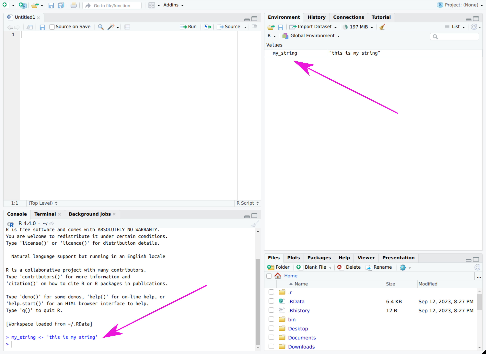
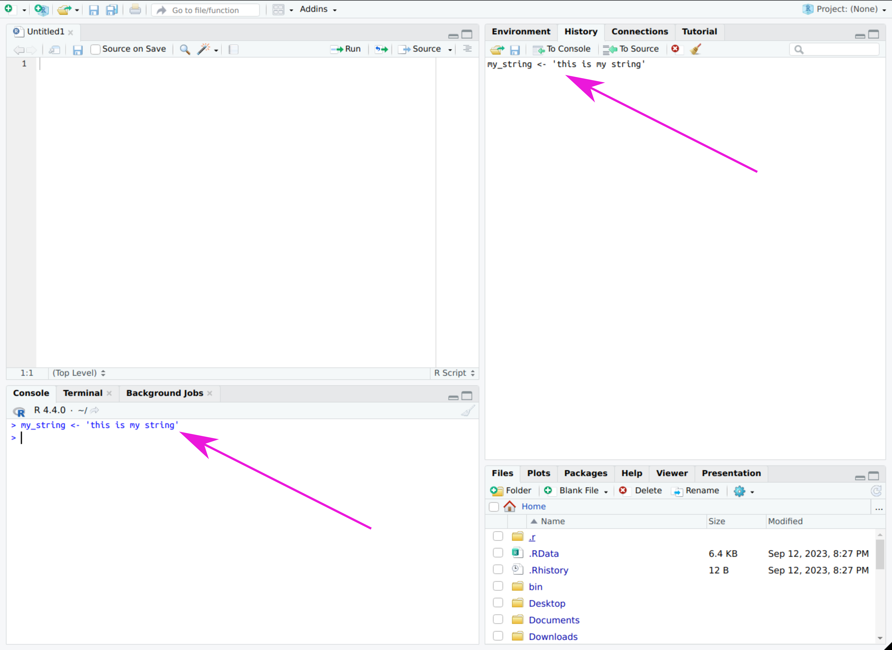
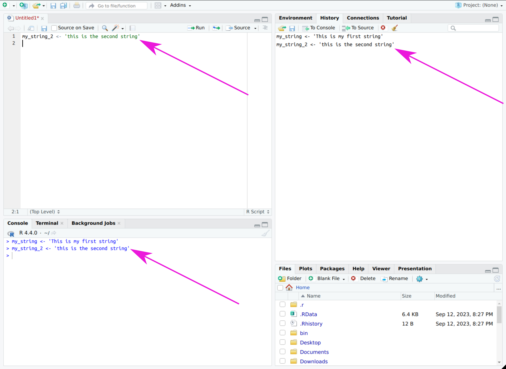
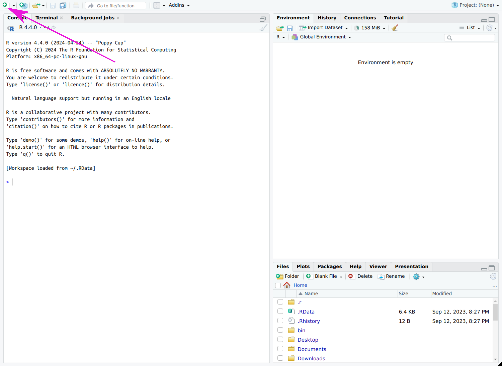

# RStudio Basics

This is an introduction to basic use of RStudio.

## Quick Reference
> R is a language that RStudio helps you use 
> Most users will only ever use the Console, Files, Plots, Help, and Scripting tabs/panels
> Single lines of a script in the scripting panel can be run by placing the cursor on them and pressing `ctrl+Enter` or `cmd+Return`
> Entire scripts can be run by clicking the 'Source' button on the script panel
> All previously generated plots are visible in the Plots tab

## R vs. RStudio -- what is the difference?
[icons for R and RStudio]
[R](https://www.r-project.org/) is a programming language, [RStudio](https://posit.co/products/open-source/rstudio/) is an "Integrated Development Environment" (IDE) that collects all the pieces of R in one place to make it easier to use. Take a look at my [introduction to the basics of R](./basics/r).

> If you want a modern point-and-click interface with R, use RStudio. If you like the "programmer/hacker" vibe of typing all the commands in a minimalist terminal, feel free to use basic R.

RStudio is one of many ways to use R, but it is a common starting place for most R users. 
It is popular because it combines may of the things that R can do in easy to understand graphical interfaces. 
For example, if you want to create a plot of some data in R without using RStudio, you would use the `plot` function, enter the name of your data into the command, and a new window opens with the plot. 

*exdata1 and exdata2 are example data frames that I can plot using the `plot()` function.*
    
If you run `plot` again, R will overwrite your plot with the new one unless you change a few different options or use specific functions to make this not happen.

*If I want to go back to the first plot after plotting the second data frame, I will have to re-run that plotting function* 

In RStudio, plots are displayed in a "plot" tab that keeps old plots when it generates a new one. 

*You can run two plotting functions in a row and still see both plots in RStudio...*
    
This allows you to look back at previous plots by clicking the forward and backward arrows.

*Click the 'back' arrow to view the previous plot.*

## Downloading RStudio (optional)
RStudio is installed on the All of Us workbench servers so you don't have to install it on your computer; however, you may want to do so if you are interested in learning the interface more in-depth so you don't have to deal with all the sign in details just to try it out.
After you install R (download it [here](https://cran.rstudio.com/)) RStudio can be downloaded [here](https://posit.co/download/rstudio-desktop/) and installed on your computer.

## The parts of RStudio
By default, RStudio shows three panels when you first open it: 

The left side of the window is the "Console/Terminal/Background Jobs" panel, the top right is the "Environment/History/Connections/Tutorial" panel, and the bottom right has the "Files/Plots/Packages/Help/Viewer/Presentation" panel.
Each of these panels and their respective tabs are briefly described below.

### The console
The console is where R is actually running.
You can enter commands in the console one at a time and get instant feedback from R. 
The console also keeps a record of previously run commands so you can scroll up and find out why your results look so awesome (or try to find where you made a mistake...). 

The terminal connects directly to your computer (or whatever RStudio is installed on).
Most people will not need to use this.

Background jobs are large processes that take long enough that you want to do other things while you're waiting.
Most users won't need to use this.

### The environment
The environment panel keeps track of the previously named objects in your R session.
For example, if you want to save a string of text for later, you might enter `my_string <- 'this is my string'` into the console.

When you do, the environment tab will update showing the object by name and the contents (or for large objects, a sample of the contents) to remind you of what is in the object.
This is especially helpful when you have a lot of objects you are working with.

The history tab gives a history of commands entered in the console, including anything run from the script pane (see below).
This may be helpful instead of scrolling up in the console because some operations have long outputs.
The history pane does not show those outputs, only the commands that were entered, making it easier to look back at your previous work.

*Press ctrl+Enter/cmd+Return when the script pane is active and the line where the cursor was will run.*
    
The connections tab allows you to connect to outside databases; for our purposes this is not necessary.

The tutorial tab allows you to go through a tutorial for how to use RStudio and R. 
First you must install the `learnr` package by clicking where it says `click here`.
This loads basic tutorials for tasks like entering and using data, characterizing tables, and so on.
This tutorial is not necessary to use the system described here, but might be a helpful additional resource for those who would like to get more experience with R.

### The files pane
The files tab is a directory of where your session of R is running, which is the root of your cloud environment by default.
You can add, delete, and rename folders, files, etc. from this tab.

The plots tab shows any graphics generated in your R session.
Click the left and right arrows in the top left of the pane to cycle back and forth through previously generated plots. 
You can export a plot to save it using the export button, and if you would like to pop a plot out into a separate window you can click 'zoom'. 
If R bogs down after you've been using it for a while and tweaking your plots, you might have too many plots in your history. 
You can delete the currently visible plot by clicking the red X button, or clear all plots by clicking the broom.

The packages tab allows you to attach and detach packages.
Packages are pre-built extensions of R that enable or simplify specific functionality. 
The packages listed in the 'packages' tab are those installed on your system. 
In your RStudio cloud environment on the AOU workbench, all the packages in the CRAN repository (the main storage space for R packages) are already installed, so you shouldn't need to worry about installing packages.
To install a package not listed, you can click `Tools > Install packages...` in the top menu. 
Type the name(s) of the package(s) and click ok, and the package will install.
To use a package, you can click the box next to the package name in the packages tab.
To load a package every time you run a script, you can add `library(package_name)` to the top of your script.

The help tab allows you to access the help files for any installed and loaded packages' functions.
In the search bar, enter the name of a function. 
If there is a function with that name, the help pages for that function will display; if the name is not recognized, a list of close matches will appear so you can choose the function you were looking for.
Sometimes multiple packages have functions that are named the same thing, so be sure to select the help page for the function from the package you intend to use!

Viewer and presentation tabs are beyond the scope of this guide.

### Scripting pane
Once you start to write scripts (see the [R introduction page](./basics/r)) the script panel will be useful.
Click on the green '+' in the top left corner of the window and select `R Script`.

A new panel will open in the top left for your R scripts.

You can write code in this panel and save it as a .R file to use later. 
You can also run code from this panel by placing the cursor on a line of code and pressing `ctrl+enter` on Windows or `cmd+return` on a Mac to run that line of code and move the cursor to the next line.
This can be very useful for testing out individual pieces of code as you write.

You can also run an entire script by clicking on `Source` in the top right of the script panel, or entering `source('script_name.R')` in the console.

If you want to run a script that is not open in the scripting pane (for example, if you have finished designing that part of your code and don't need to modify it further) you can run it by typing `source('myscript.R')` in the console, or adding that line to another script.

## Customization
RStudio has a lot of options for changing its look and feel, including changing color schemes, panel locations, and even text entry options (Vim, Emacs, etc.). 
All of these options are found in the Tools > Global Options menu.
In its default configuration, though, RStudio provides a useful structure to learn how to code and use R for essentially anything you want to work on.
Also, in the RStudio cloud environment on the AOU researcher workbench, every time you start up a new environment all the settings revert to the default.
This may be due to the 'Beta' status of the RStudio integration which doesn't allow you to pause your session, so this quirk may disappear once the beta testing period ends.

## Other helpful features of RStudio
RStudio has a feature that puts red 'X's in the margin to the left of your script as you're working on it, but it might not tell you what is actually wrong, just where in the code it has figured out that something is wrong.
Hover your mouse over the red X to see the message associated with the error.

By default, RStudio tracks opening and closing parentheses while you write a script. 
When your cursor crosses a parenthesis, the matching one is highlighted with a purple background. 
If a parenthesis doesn't have a match, it is highlighted in red.
