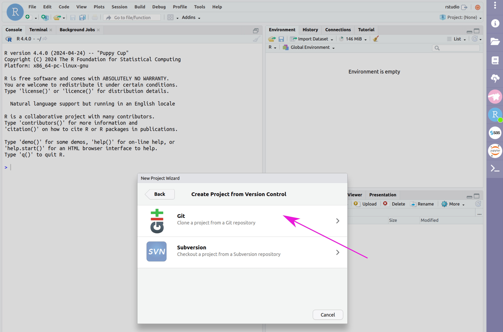
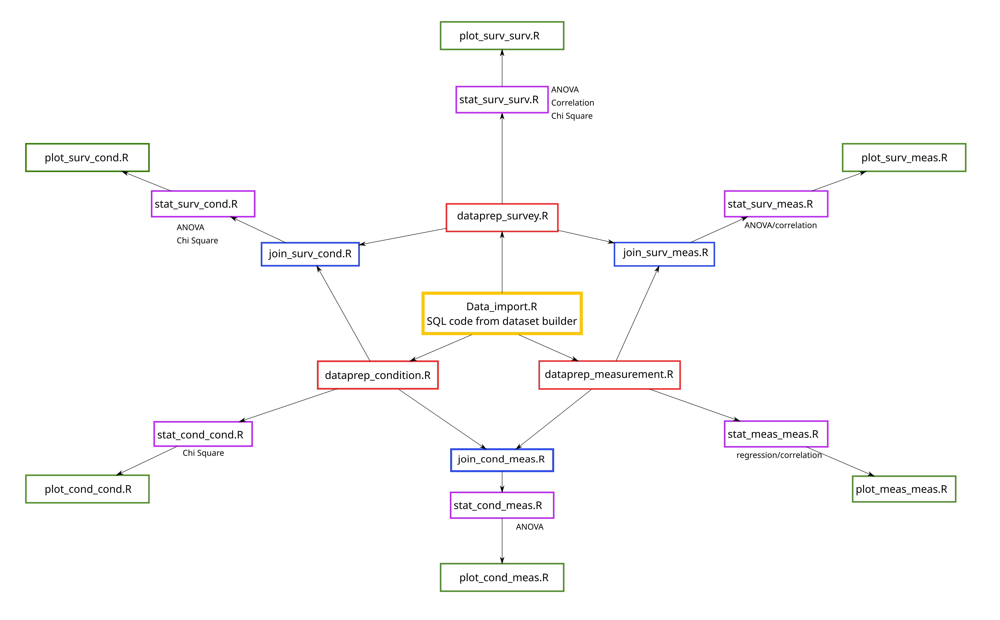

# Coding Instructions

## Quick Reference:
> 1. Generate your dataset on the researcher workbench
> 2. Initialize your RStudio cloud environment
> 3. Import the cookbook from GitHub
> 4. Copy the SQL code into 'Data_import.R'
> 5. Determine the analysis you would like to run and which files need to be run to accomplish that
> 6. Identify and modify code to adjust the existing system to do what you want it to
> 7. Type `source('filename.R')` into the RStudio console and press `Enter` or `Return` for each file in order, from top to bottom of the flowchart
> 8. Look at the outputs and download your plots and statistical reports

Here is an [example of a coding workflow](/AOU_R/examples/bmi_coding) that implements these steps.

## Full Instructions:
To modify and use the automated analysis I've built, follow the instructions below:

### 1. Generate the desired dataset from the dataset builder on the AoU workbench
This is a detailed process that deserves its own page, [like this one](/AOU_R/how-to/dataset).

Additional help can be found [here](https://support.researchallofus.org/hc/en-us/articles/4556645124244-Using-the-Concept-Set-Selector-and-Dataset-Builder-tools-to-build-your-dataset).

This system requires that the data have a few specific elements and meet a few requirements to automatically process. 
The guidelines can be found [here](/AOU_R/datareqs). 

The code includes commented lines with instructions that will let you select some alternative approaches, analyses, or outputs. 
In most cases, if you uncomment a line, it will be after the original line and will overwrite the original coded process; if this is not the case, a comment in the code indicates this. 
You may also want to comment out the original lines of code if you find you have to wait for a long time (more than a few minutes) for one of the steps to run. 
Make sure at least one of the lines of code is uncommented so you don't run into errors!
[screenshot of commenting/uncommenting code]

### 2. Initialize your RStudio cloud environment
In the workspace, click on the RStudio icon (blue circle with 'R' in it) on the right hand side, then click "Start" at the bottom of the page.
This may take several minutes, but when the spinning green arrows on the RStudio icon change to a green dot, your cloud envrionment is ready to use.
Click the RStudio icon again and then "Open RStudio".

### 3. Import the script files to RStudio
In RStudio, click File > New Project... > Version Control > Git (if a popup asks if you want to save your .RData file, say No). 
Enter the repository URL: 
```https://github.com/ESodja/AOU_R.git```
and name the project directory, (`AOU_R` may autopopulate, but if not, enter it in that box). 
Click 'Create Project'. 
This will copy all the pages from the github site where this website lives into your directory. The .R files you will be working with are in the R_Files folder.





### 4. Copy the SQL code to Data_import.R
In the dataset builder (after you've selected your data; see step 1), click on 'Analyze', select the 'R' button, click 'Copy Code' and wait until a message tells you it has been copied to the clipboard (this may take several seconds). 
Click 'Cancel' in the popup window, click on the RStudio icon (blue circle with "R" inside) in the purple bar on the right side of the window, and click 'Open RStudio'. 

Your Files tab should already have the R scripts from the zip file or the copy of the files from the GitHub site. Click on Data_import.R to open it in the script editor pane (look in the R_Files folder), then below the comments at the top of the file paste the SQL code copied from the dataset builder. Save this file and close it.

> Tip: If you change *anything* about the dataset definition in the dataset builder on the workbench, you will have to re-do this step!


*After dataset is built, click 'Analyze'*


*Click the button next to R and then Copy Code*


*Wait for confirmation of the copy and click Cancel*


*Click on the RStudio icon*


*Click 'Open RStudio'*


*Click Data_import.R*


*Paste the copied code into the script*


*Save and close the script*


### 5. Determine analyses to run
Depending on what kind of data you are using, you will need to use different analyses.
The basic analyses we will work with are outlined in the table below:

|                         | Categorical Dependent | Continuous Dependent          |
|:-----------------------:|:---------------------:|:-----------------------------:|
| Categorical Independent | Chi Square            | ANOVA                         |
| Continuous Independent  | Logistic regression   | Linear Regression/correlation |

These analyses are listed at the bottom of the flowchart below.


From there, trace the arrows back to the specific files that need to be run.
Anything "upstream" from the desired goal on the bottom row needs to be run, starting from the top.
For example, if I am trying to run an ANOVA analysis for measured values against survey responses, I would start from the box with `catsurv_meas_plot.R`, and trace it back to `join_catsurv_meas.R`, `dataprep_survey.R`, `dataprep_measurement.R`, and `Data_import.R`.

[screenshot highlighting this example]

These should be run in order starting from the top (the order of files on the same level don't matter, e.g. dataprep_survey.R and dataprep_measurement.R can be run in that order or reversed). 
For more details on what each type of file does (i.e. a row of the flowchart), refer to these pages: 
- [Data prep files](/AOU_R/dataprep)
- [Join files](/AOU_R/joins)
- [Plot files](/AOU_R/mods/plots) 
- [Analysis files](/AOU_R/mods/analysis)

`Data_import.R' is essential and should be run first to pull the data from the database.
`dataprep_[something].R` files are helpful to clean and structure data for analysis.
If you are joining two types of data, e.g. condition and survey data, you should run `join_surv_cond.R' to connect them together based on the id of the individuals in your data.
Generating plots of a given relationship is achieved by using the `plot_[something].R` files.
Analyses are done in files with the name of the analysis in the file name, e.g. an ANOVA analysis between condition and measurement data is performed by `cond_meas_anova.R`. 

Guidelines for modifying joins, plots and analyses are available:
- [Join modifications](/AOU_R/joins#modifications)
- [Plot modifications](/AOU_R/mods/plots#modifications) 
- [Analysis modifications](/AOU_R/mods/analysis#modifications)

If you need to modify any plots, it might be helpful to comment out the lines with the `png()` function and the `dev.off()` function (these are the lines that open and close, respectively, the .png writer).
This will make RStudio produce plots in the Plot tab each time the plotting script is run, so you can tinker with the settings and view the results more quickly.
Once you're satisfied with the plot, uncomment the `png()` and `dev.off()` lines to generate a downloadable output plot.

After modifying the files (except plotting files, though it wouldn't hurt for these as well), you will probably want to restart R (click on session > Restart R) and run each file individually from the beginning to make sure the results are correct.

If data joins need to be modified, the R files used in the next row up on the flowchart (named like `dataprep_[something].R`) should also be modified so that the join includes the right data in the correct format. 
Instructions will be included in the join files for common ways to do this. 

### 6. Run each file in order in the console
Enter `source(‘filename.R’)` for each necessary file, starting from the top (the first one should be `Data_import.R`).
If you try to run `source('master.R')` after modifying any of the R scripts, there is a good chance it won't work correctly or will encounter an error along the way.

You can also open each file and run each line individually by placing the cursor on the first line of the script and pressing `ctrl+enter` (or `cmd+return`) repeatedly, once for each line of the file. 
This is especially helpful if you've modified the code somewhere and need to track down an error, since the error will appear in the console after you run the line that produces the error.

### 7. View and download the generated outputs
All generated outputs are available under the “files” tab in RStudio.
By default, the plotting scripts generate downloadable .png files of any plots they generate.
You can find these output files under the Files tab, usually in the home directory. 
Check the boxes next to the files you want to download and click More > Export.
Text of statistical analyses are saved as .csv files, which can be downloaded in the same way as the plots.

If the output plots need modification, you can open the plotting files (`plot_[something].R`; bottom row of the flowchart) and follow commented instructions and alternative code to modify the output. 
These changes only require re-running the ploting file and not the entire analysis. 
    
### 8. Delete your cloud environment
When you are done with your analysis, you will need to delete your cloud environment to avoid your cloud computing budget from draining while you're not using it. 
By default, your RStudio environment is automatically deleted after 1 day of inactivity, so if you miss this step it's not a big deal. 
You also have a persistent disk associated with your cloud environment that costs a small amount to maintain -- this is where output files are stored for a given workspace.

An easy way to think about this: the cloud envrionment is like a computer that you are paying for time on, the persistent disk is like a flash drive you are renting.
You can use the computer to generate some output files, which are saved to the flash drive.
If you've copied the outputs to some other location, you don't need the flash drive anymore and can stop renting it (i.e. delete it).
If you delete your persistent disk, the .R files you've used to run your analysis will disappear, but if you're using my files from GitHub you can just import them again.
The dataset builder and cohort builder settings will be saved with the workspace.

## Notes:
Overviews of each step of the analysis process and how to modify them are available in the following pages:
> [Data preparation](/AOU_R/dataprep)
> [Modifying variables](/AOU_R/mods/variables)
> [Joins](/AOU_R/joins)
> [Modifying plot outputs](/AOU_R/mods/plots)
> [Analyses](/AOU_R/mods/analysis)


