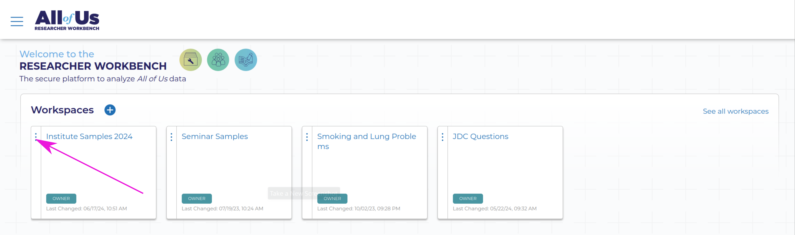

    
# How to copy a workspace
Before you can copy a workspace, it has to be shared with you.
On the first day of the institute I will get your workbench account username so I can share the pre-made workspace with you for the second day activities.

Between the first and second days, your assignment will be to copy the workspace to your account.
To do this, on your workbench account (accessed via researchallofus.org > click on "Researcher Login") look for the workspace named "Institute Samples 2024", click on the three dots of the menu on the left and click duplicate.
This may take some time, but eventually you will be able to view and edit the workspace, including the analysis, description, etc.

Other example workspaces are available on the workbench.
Click on the three lines next to the All of Us logo on the top of the screen in the workbench, and click "Featured Workspaces".
These are examples for a range of different topics, including simple data analyses, examples of studies previously completed using All of Us data, etc.
Feel free to explore these on your own!
