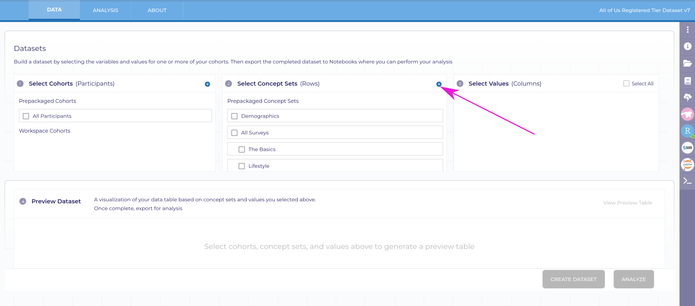
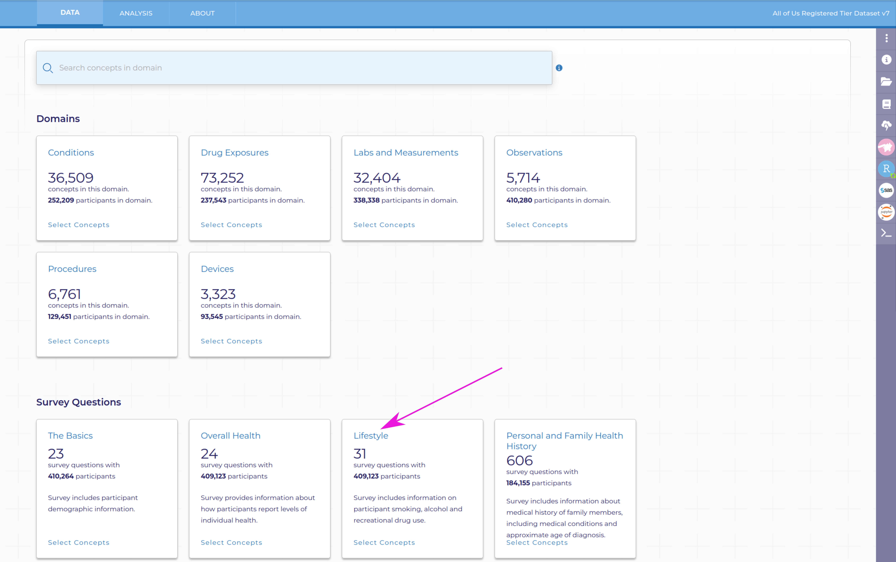
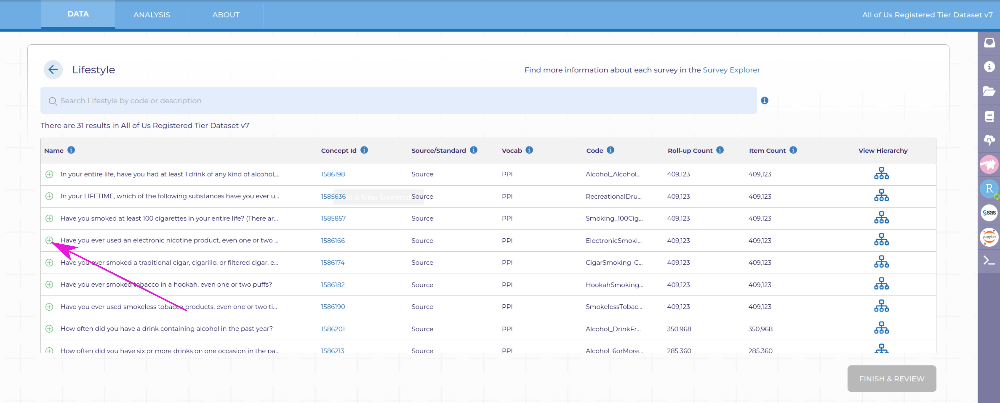
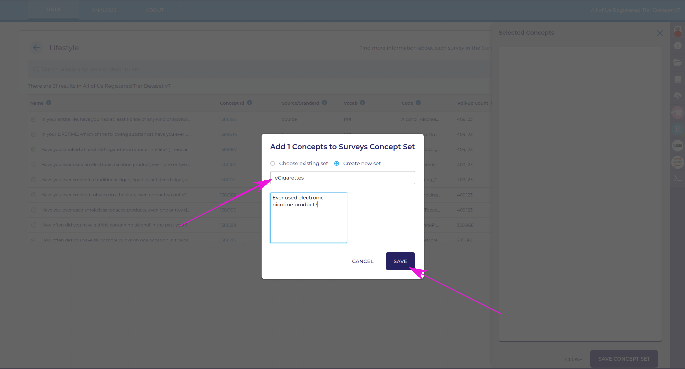
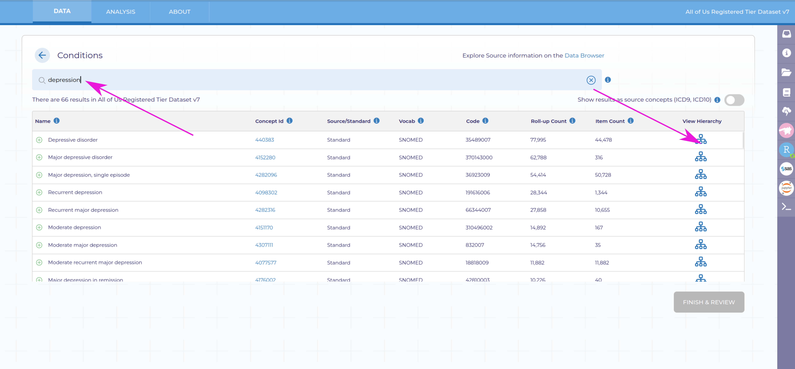
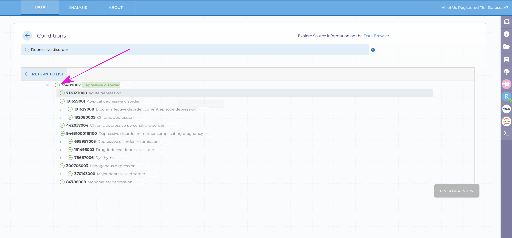
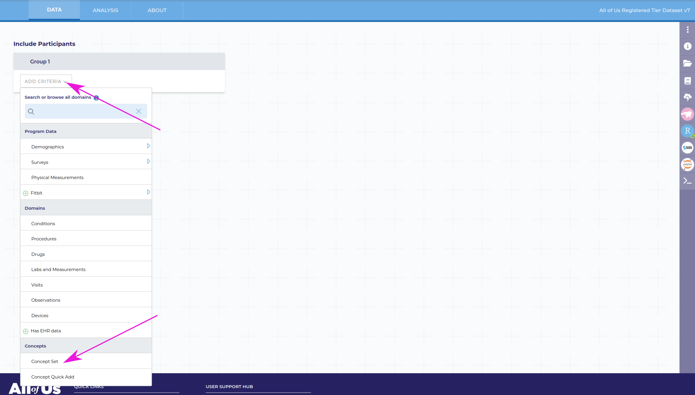
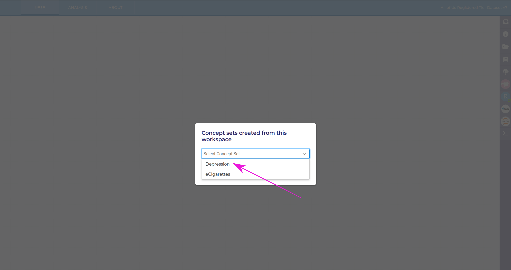
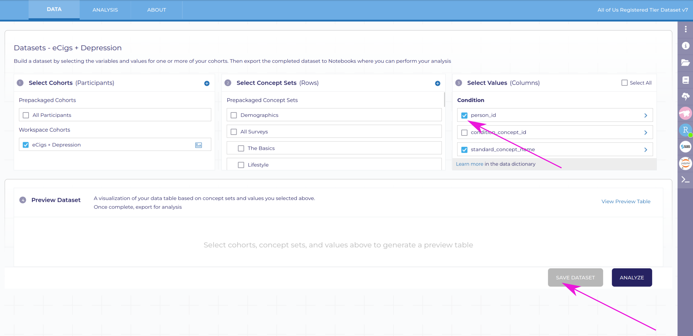

    
# Building a dataset
The first step (once you've decided your research question!) of any project in the All of Us platform is to choose which data your would like to use.
This is a particularly important step if you are going to use the automated scripts I've put together for this year's institute -- the input data [needs to be in the correct format](./datareqs) or the analyses won't work.

**I have found an order to do things that I think will help the process go more smoothly,** which I outline below. 
If you would rather dive in and figure things out, that is up to you.

## Before you start
A few definitions can be helpful to understand what you are doing with the dataset builder:

> Cohort: a group of people on which a study is run/for whom you have data.

*When you are using the "Cohort Builder" part of the dataset builder, you are choosing which people you want data for, NOT the data you will actually be using.*

> Concept set: a type of data collected for participants, e.g. a medical measurement, survey answer, or diagnosis.

## Building a new workspace
Each workspace can have several datasets, cohorts, analyses, etc. within them. 
However, each workspace should be focused on a particular goal or associated group of research questions in order for the project to be easily reviewed according to the All of Us policies.
When you click on "build a new workspace" from your workbench home page, you will be taken to a page where you can name your workspace and provide descriptions about your goals, approaches, and plans for distribution of results.

## Building a dataset
### Concept sets
After you have the workspace started, you can build your dataset.
I have found that the easiest way to build a new dataset is to start by defining what data you want to use.
Click on the + next to "Datasets" to add a new dataset:

You will see a window with three columns in the top where you can choose cohorts, concept sets, and values (we will cover all of these eventually, so don't worry if they don't make sense yet).

Click on the + sign next to "Select Concept Sets", which will take you to the page below:

You can search for a concept here, but in many cases it will be easier to select a domain or group of survey questions first to find the data your are looking for.
In my example for these screenshots, I was interested in lifestyle survey questions, so I clicked on the "Lifestyle" box.

I could search for topics in the lifestyle questions, but I saw one I was interested in on the list -- "Have you ever used an electronic nicotine product, even one or two times?"
Add the concept you are interested in to your concept set by clicking the green + sign next to the concept you are interested in.
Once you've added this concept, a red dot will appear in the "inbox" symbol in the top right of the screen. 
When you're done adding all the concepts within a given category (in this case, lifestyle survey questions), click "Finish & Review" at the bottom.
Once you've named your concept set and provided a brief description, click "Save".

You can then create another concept set (click that button).

This concept set will be what I compare the first one to -- in this case, I am going to look at the connection between electronic nicotine products and depression.
So in the concept set domains page, I will click on "conditions".

Within conditions, I will search for depression.
Sometimes it is easier to view a heirarchy of conditions because the terms we commonly use for a given condition are usually high-level -- there are a lot of different kinds of depression, in this case.

To see the heirarchy, click on the symbol under "View Heirarchy" in the table.

At the very top, we have "Depressive disorder". For the example I am doing here, that will be good enough, but note that this includes everything from bipolar affective disorder to menopausal depression -- these are all very different types of depression that I would want to put more thought into if I were actually trying to understand its relationship to electronic nicotine.

### Cohorts
To choose which people you want data for, you have to select a cohort.
This is especially important if you want to study a population that may have a unique relationship to a given condition (e.g. sickle cell anemia among individuals of African descent) or that has been under studied for common health issues because of previous exclusionary research practices.

To choose your cohort, from the home page of your workspace, select "Create cohort".
This will take you to a page where you can apply a series of filters to select your cohort.
Under "Group 1", you can include participlants that have any of the various data types included in the dataset.
Because we selected the concept sets first, we can easily select the individuals that have data for those concept sets.
Click on "Add Criteria" under group 1, select "Concept Set" near the bottom of the menu, then select one of the concept sets.

To add another cohort filter that has data for a given concept set, we repeat the process.
Note that you can add another filter to group 1 using the "Add Criteria" button, or add a cohort filter to group 2.
Adding a filter to group 1 creates an "or" filter, meaning that for this example I would get all of the participants that have diagnosed depression OR answered the electronic nicotine question. 
If I add the filter to the Group 2 box, it would create an "and" filter, meaning that I would have a cohort that was diagnosed with depression AND answered the electronic nicotine question -- likely a smaller group, since not every participant fits in either of the groups.
In this case, I want the OR filter so that I get a full range of people -- those who answered the survey only, those who were diagnosed with depression only, or those who have both been diagnosed and answered that survey question.

### Create a dataset
Once you save the cohort and you're happy with your cohorts and concept sets, click on "Create a Datset".

In the page that will appear, you should see a cohort column, a concept column, and a values column.
In the cohort column, find the Workspace Cohorts section and the cohort you saved earlier, and check the box.
In the concept sets, find your concept sets under "Workspace Concept Sets" and check the boxes.

Finally, we have to choose which data we want for each individual in the cohort for the concept sets we've selected. 
This is analogous to the columns of the data, where each individual has a row.
I usually uncheck the "Select All" box (so all the boxes are unchecked) and then add in the boxes that are necessary for what I want to do. 
In this example, I want the person_id column (so that I can connect different types of data together for each person) and the standard_concept_name column for the condition, and the person_id, question, and answer columns for the survey values (scroll down in this list to find each concept set's unique columns).

Click on Create Dataset to add in a name and a description of the dataset, and then Analyze to start working with your data!

## Next up
Initialize your RStudio environment!
