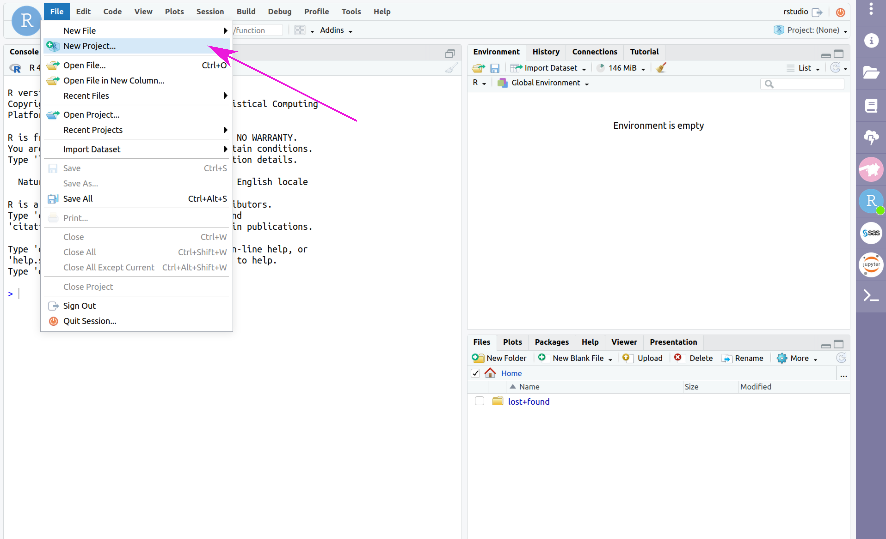
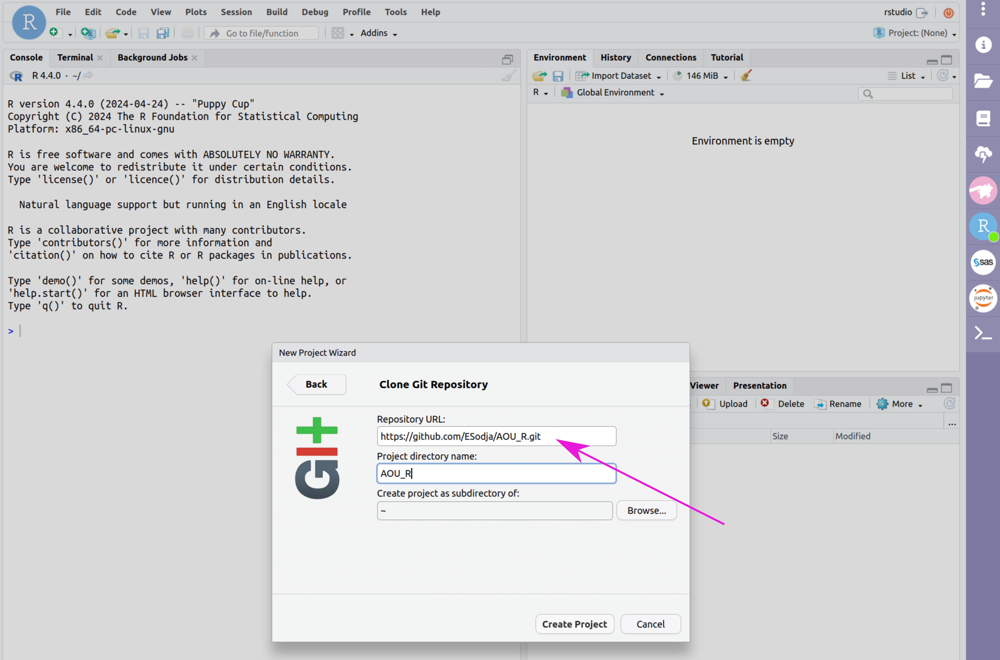
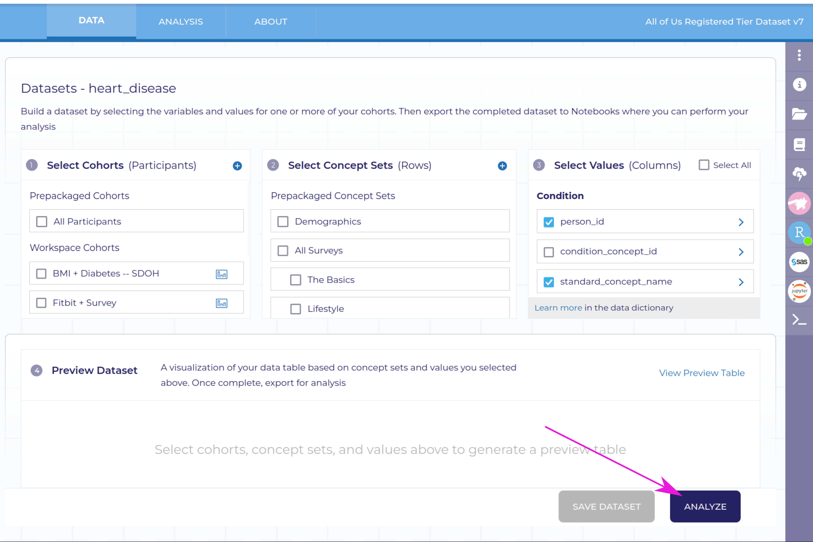
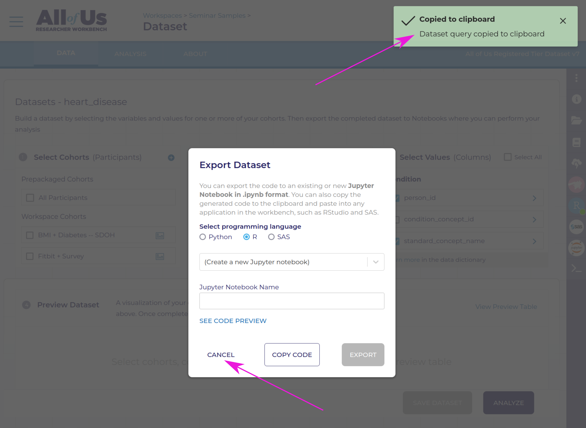
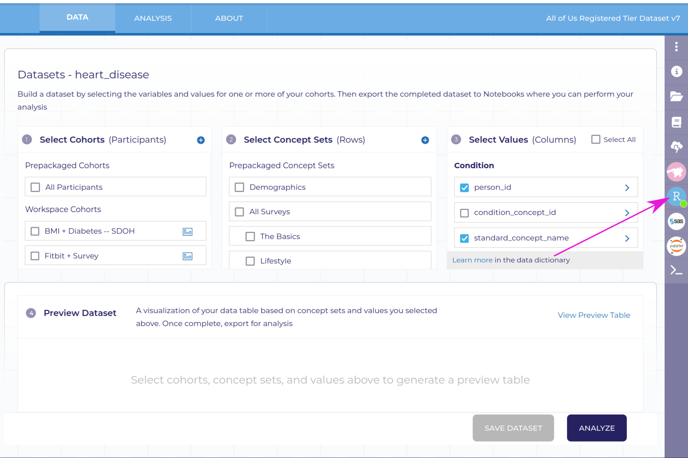
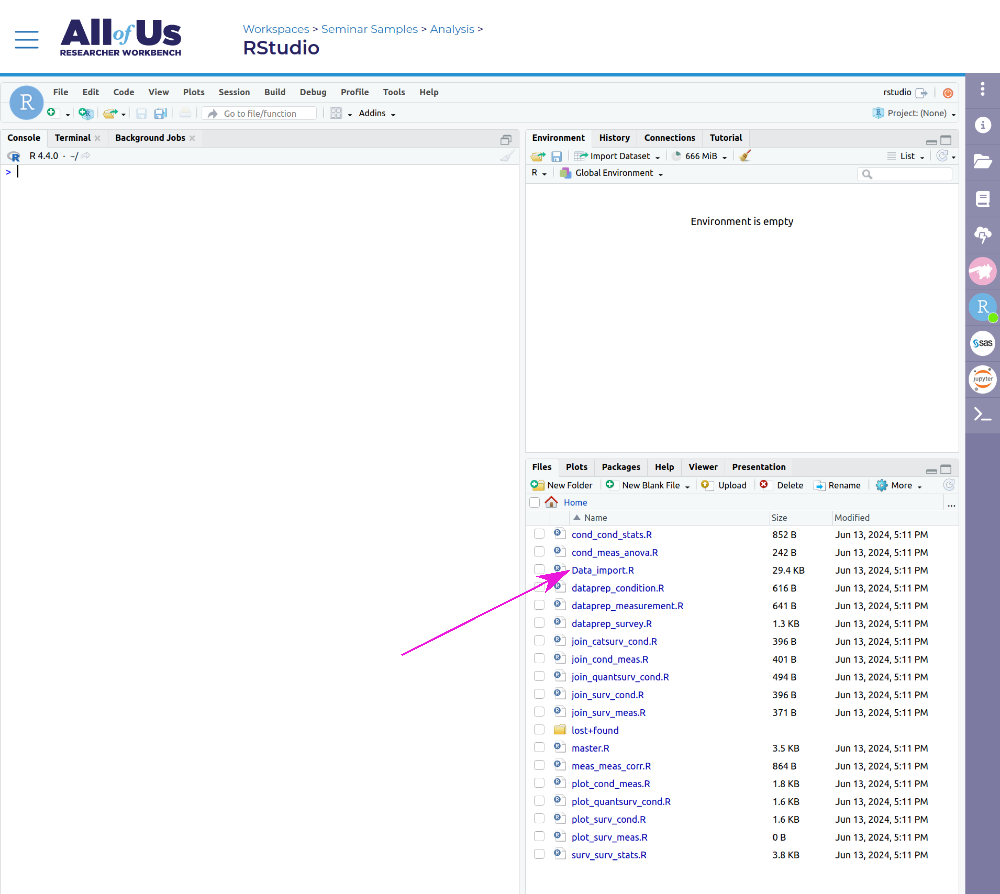
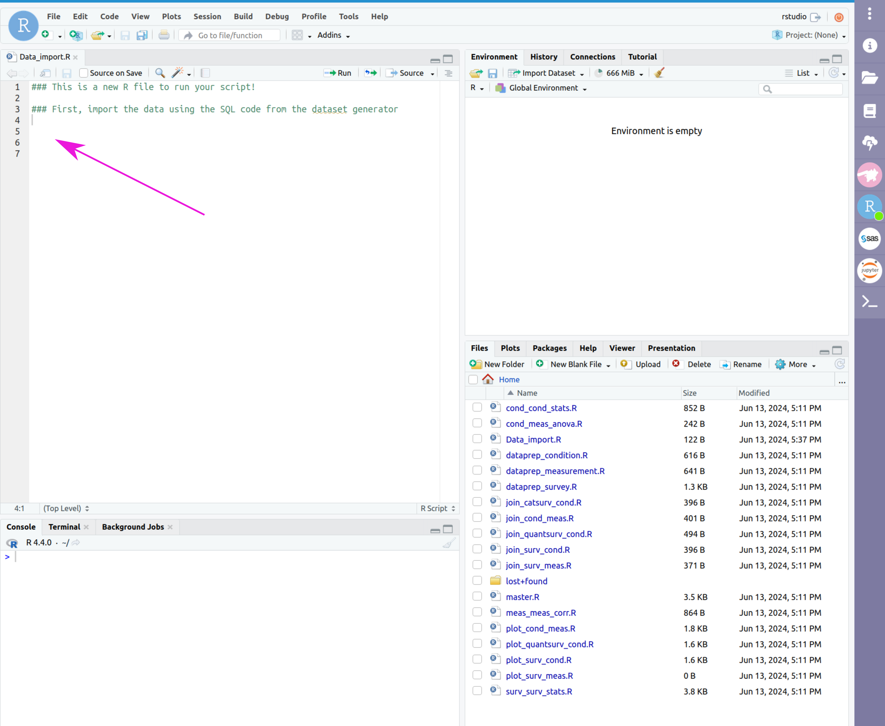

# Non-coding Instructions

## Quick Reference
> 1. Generate your dataset on the researcher workbench
> 2. Initialize your RStudio cloud environment
> 3. Import the cookbook from GitHub
> 4. Copy the SQL code into 'Data_import.R'
> 5. Type `source('master.R')` into the RStudio console and press `Enter` or `Return`, and answer the questions that come up in the console
> 6. Look at the outputs and download your plots and statistical reports

## Full Instructions
To use the automated analysis I've built for this group, follow the instructions below:
### 1. Generate the desired dataset from the dataset builder on the AoU workbench
This is a detailed process that deserves its own page, [like this one](/AOU_R/how-to/dataset).

Additional help can be found [here](https://support.researchallofus.org/hc/en-us/articles/4556645124244-Using-the-Concept-Set-Selector-and-Dataset-Builder-tools-to-build-your-dataset).

The data that can be automatically processed by this system needs to have a few specific elements and meet a few requirements to work. The guidelines can be found [here](/AOU_R/datareqs).

### 2. Initialize your RStudio cloud environment
In the workspace, click on the RStudio icon (blue circle with 'R' in it) on the right hand side, then click "Start" at the bottom of the page.
This may take several minutes, but when the spinning green arrows on the RStudio icon change to a green dot, your cloud envrionment is ready to use.
Click the RStudio icon again and then "Open RStudio".

### 3. Import the cookbook files
In RStudio, click File > New Project... > Version Control > Git (if a popup asks if you want to save your .RData file, say No). 
Enter the repository URL: 
```https://github.com/ESodja/AOU_R.git```
and name the project directory, e.g. `AOU_R`. Click 'Create Project'. This will copy all the pages from the github site where this website lives into your directory. The .R files you will be working with are in the R_Files folder.







### 4. Copy the SQL code to Data_import.R

In the dataset builder (after you've selected your data; see step 1), click on 'Analyze', select the 'R' button, click 'Copy Code' and wait until a message tells you it has been copied to the clipboard (this may take several seconds). Click 'Cancel' in the popup window, click on the RStudio icon in the purple bar on the right side of the window, and click 'Open RStudio'. 

Your Files tab should already have the R scripts from the zip file or the copy of the files from the GitHub site. Click on Data_import.R to open it in the script editor pane (look in the R_Files folder), then below the comments at the top of the file paste the SQL code copied from the dataset builder. Save this file and close it.

> Tip: If you change *anything* about the dataset definition in the dataset builder on the workbench, you will have to re-do this step!


*After dataset is built, click 'Analyze'*


*Click the button next to R and then Copy Code*


*Wait for confirmation of the copy and click Cancel*


*Click on the RStudio icon*


*Click 'Open RStudio'*


*Click Data_import.R*


*Paste the copied code into the script*


*Save and close the script*


### 5. Run the program
Enter `source(‘master.R’)` in the RStudio console. After some time (some steps take a while, depending on how large your dataset is), the console will ask some questions about your data and the analysis you want to do, and then proceed based on your answers.


*Enter source('master.R') in the console*


*Answer questions to confirm detected data*
                          
<!--The questions are outlined in the figure below:
[flowchart of questions]

> Tip: You can go through the questions in the flowchart above beforehand to know what to answer when it comes up.-->

### 6. Look at the outputs
You can find the generated outputs (plots, statistical results, etc.) in the RStudio “files” tab and select which files to download.
All of these have been designed to comply with the terms of service for registered-tier workbench access.

### 7. Delete your cloud environment
When you are done with your analysis, you will need to delete your cloud environment to avoid your cloud computing budget from draining while you're not using it. 
By default, your RStudio environment is automatically deleted after 1 day of inactivity, so if you miss this step it's not a big deal. 
You also have a persistent disk associated with your cloud environment that costs a small amount to maintain -- this is where output files are stored for a given workspace.

An easy way to think about this: the cloud envrionment is like a computer that you are paying for time on, the persistent disk is like a flash drive you are renting.
You can use the computer to generate some output files, which are saved to the flash drive.
If you've copied the outputs to some other location, you don't need the flash drive anymore and can stop renting it (i.e. delete it).
If you delete your persistent disk, the .R files you've used to run your analysis will disappear, but if you're using my files from GitHub you can just import them again.
The dataset builder and cohort builder settings will be saved with the workspace.

## An Example
Take a look at this [example of a non-coding analysis](/AOU_R/examples/bmi_noncoding).
