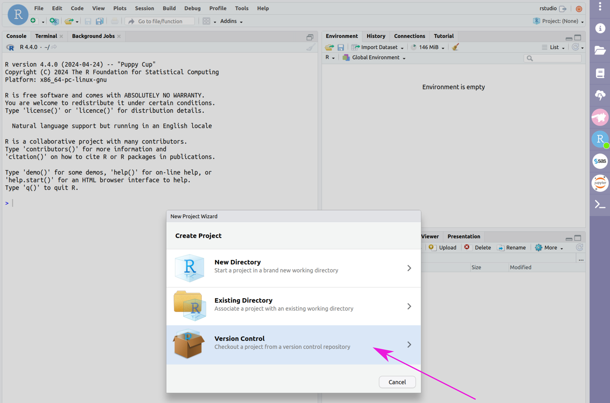
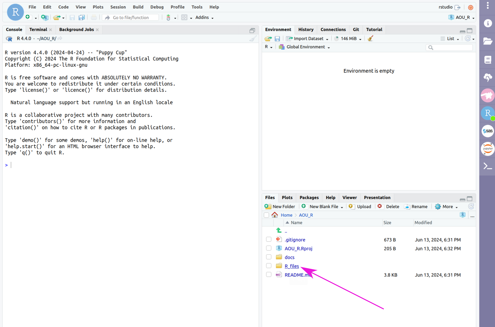
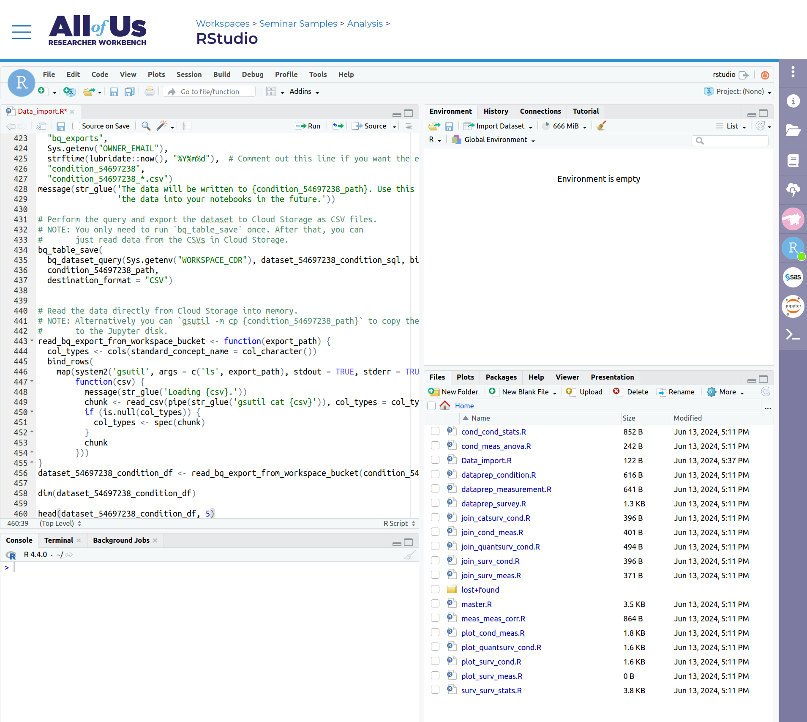

# Non-coding Instructions

## Quick Reference
> 1. Generate your dataset on the researcher workbench
> 2. Initialize your RStudio cloud environment
> 3. Import the cookbook from GitHub
> 4. Copy the SQL code into 'Data_import.R'
> 5. Type `source('master.R')` into the RStudio console and press `Enter` or `Return`, and answer the questions that come up in the console
> 6. Look at the outputs and download your plots and statistical reports

## A few notes:
The Workbench website often struggles to scale to smaller screen sizes (i.e. laptops) appropriately.
Depending on your computer and browser settings, not all parts of the Workbench may be visible at the same time.
If you can't see any of the commands, you may need to zoom out your browser -- press `ctrl + -` or find your browser view settings and zoom out.

## Full Instructions
To use the automated analysis I've built for this group, follow the instructions below:

### 1. Generate dataset on the Dataset Builder 
This is a detailed process that [deserves its own page](/AOU_R/how-to/dataset).

Additional help can be found [in the *All Of Us* workbench tutorials](https://support.researchallofus.org/hc/en-us/articles/4556645124244-Using-the-Concept-Set-Selector-and-Dataset-Builder-tools-to-build-your-dataset).

When choosing the data to use for your analysis, keep in mind that **this automated analysis system cannot cover all the different data combinations that are possible on the Workbench**. 
I am working on a [page of data requirements](/AOU_R/datareqs) that will be updated as more options become available.

### 2. Initialize your RStudio cloud environment
In the workspace, click on the RStudio icon (blue circle with "R" in it) on the right hand side, then click "Start" at the bottom of the page.
This may take several minutes, but when the spinning green arrows on the RStudio icon change to a green dot, your cloud envrionment is ready to use.

From the Database Builder page, duplicate a tab in your browser window -- Right click on the tab and find "Duplicate" or "Duplicate Tab".

In the new tab, click the RStudio icon in the purple bar on the right, scroll down and click "Open RStudio".
This tab will be the RStudio tab, and the original tab we want to leave at the Database Builder view.

### 3. Import the Cookbook files
In RStudio, click "File > New Project... > Version Control > Git" (if a popup asks if you want to save your .RData file, say No). 

Enter the repository URL: 
```
https://github.com/ESodja/AOU_R
```
and name the project directory `AOU_R` (make sure it is capitalized). 

Click 'Create Project'. 
This will copy all the pages from the GitHub site where this website lives into your directory. 
The .R files you will be working with will be impored into the R_files folder.


*Click on File > New Project*


*Choose "Version Control"*


*Choose "Git"*


*Enter the GitHub repository URL `https://github.com/esodja/AOU_R`, and project directory name as `AOU_R`, and click on "Create Project*


*Find the R script files in the Files tab under R_files*

### 4. Copy the SQL code to Data_import.R
In the Dataset Builder (the tab you were originally working in; see the end of step 2 above), click on 'Analyze', select the 'R' button, click 'Copy Code' and wait until a message tells you it has been copied to the clipboard (this may take several seconds). 

Switch to the RStudio tab.

Your Files tab in RStudio should already have the R scripts from the GitHub site. 

Click on the R_files folder, and then click on Data_import.R to open it in the script editor pane 

Paste the SQL code copied from the dataset builder (the comments in the file don't need to stay in there, you can paste over them wihtout causing problems). 

Save this file.

Go back to the Database Builder tab and click on "See Code Preview" above the "Cancel" button.

Check the numbers of the database import SQL code that appears next to the "Export Dataset" popup window (see screenshots [coming soon]) and compare them to the numbers in your Data_import.R file in the RStudio tab.

If the numbers don't match (most likely if this is not the first attempt at your analysis!) you will need to once again copy the code by clicking the "Copy Code" button in the Dataset Builder tab, and then paste the code into `Data_import.R` in the RStudio tab.

If the numbers match, you can save and close `Data_import.R`.

> Note: If you change *anything* about the dataset definition in the Dataset Builder, you will have to redo this step!


*In your duplicated tab, click on the RStudio icon*


*Click 'Open RStudio'*


*Click Data_import.R*


*In your Database Builder tab, click 'Analyze'*


*Click the button next to R and then Copy Code*


*Wait for confirmation of the copy*


*Paste the copied code into the Data_import.R file*

*Check that the numbers in the file match those of the code preview in the Dataset Builder tab*
[screenshot coming soon]


*Save and close the script*


### 5. Run the program
Enter `source(‘master.R’)` in the RStudio console. 

After some time (some steps take a while, depending on how large your dataset is), the console will ask some questions about your data and the analysis you want to do, and then proceed based on your answers.


*Enter source('master.R') in the console*


*Answer questions to confirm detected data*
                          
The questions are outlined in the figure below, and clarifications and explanations are in [this page] [coming soon...]:
[flowchart of questions]

> Tip: You can go through the questions in the flowchart above [coming soon] while planning your analysis to know what to answer when it comes up.

### 6. Look at the outputs
You can find the generated outputs (plots, statistical results, etc.) in the RStudio “Files” tab, in the R_files folder.

To save outputs, check the box next to the files and click on "More > Export..." and download a zip file.

All of these have been designed to comply with the terms of service for registered-tier Workbench access.

### 7. Delete your cloud environment
When you are done with your analysis, you will need to delete your cloud environment to avoid your cloud computing budget from draining while you're not using it. 
By default, your RStudio environment is automatically deleted after 1 day of inactivity, so if you miss this step it's not a big deal. 
You also have a persistent disk associated with your cloud environment that costs a small amount to maintain -- this is where output files are stored for a given workspace.
If you've downloaded the outputs you want to save, you can delete your persistent disk without an issue.
If you only delete your cloud environment and not the persistent disk, the files should be available next time you log in.

An easy way to think about this: the cloud envrionment is like a computer that you are paying for time on, the persistent disk is like a flash drive you are renting.
You can use the computer to generate some output files, which are saved to the flash drive.
If you've copied the outputs to some other location, you don't need the flash drive anymore and can stop renting it (i.e. delete it).
If you delete your persistent disk, the .R files you've used to run your analysis will disappear, but if you're using my files from GitHub you can just import them again.
The dataset builder and cohort builder settings will be saved with the workspace.

To delete your environment, in the Workbench (in RStudio or Database Builder, it doesn't matter) click on the RStudio icon on the right side of the screen and scroll down to click on "Delete Environment". 

Choose the option that says either delete environment and keep persistent disk, or else delete both environment and persistent disk, depending on your goals.

## An Example
Take a look at this [example of a non-coding analysis](/AOU_R/examples/bmi_noncoding).
